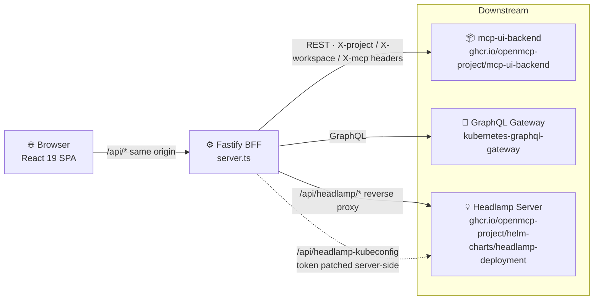

****# Operator Guide

This guide covers deploying and running the Control Plane UI in your organisation.

## Architecture Overview



The **Fastify BFF** (`server.ts`) is the only component in this repository. The browser never contacts downstream services directly — all traffic flows through `/api` on the BFF.

- **mcp-ui-backend** — REST backend serving Crossplane / Flux / Landscaper CRDs. Published as `ghcr.io/openmcp-project/mcp-ui-backend`; source not currently public.
- **GraphQL Gateway** — [kubernetes-graphql-gateway](https://github.com/platform-mesh/kubernetes-graphql-gateway) (public); serves the GraphQL schema for the Projects / Workspaces space.
- **Headlamp** — [Headlamp](https://headlamp.dev) is an optional embedded Kubernetes dashboard. Deploy it via the Helm chart at `ghcr.io/openmcp-project/helm-charts/headlamp-deployment` and point the BFF at it with `HEADLAMP_UPSTREAM_URL`. When provisioned, users can switch any Control Plane detail page into "open-source" view to browse live cluster resources without `kubectl`.

## Supported Target Setup

| Component | Details |
|---|---|
| Container runtime | Docker / containerd |
| Deployment | Docker image (`ghcr.io/openmcp-project/mcp-ui-frontend`) served via nginx |
| Auth | OIDC (configurable issuer, client ID) |
| Backend | Crossplane + Flux + Landscaper CRDs via the BFF proxy |
| GraphQL | [kubernetes-graphql-gateway](https://github.com/platform-mesh/kubernetes-graphql-gateway) |

## Building the Docker Image

```bash
# Using Taskfile (recommended)
task build:image:local TAG=my-tag

# Or directly
docker build -t ghcr.io/openmcp-project/mcp-ui-frontend:my-tag .
```

## Configuration

The UI reads `frontend-config.json` at runtime. In production, nginx serves its content from the `BACKEND_CONFIG` environment variable:

```bash
docker run -p 80:80 \
  -e BACKEND_CONFIG="$(cat frontend-config.json)" \
  ghcr.io/openmcp-project/mcp-ui-frontend:latest
```

See `frontend-config.json` at the repo root for the available fields.

## OCM / Platform Service

The `ocm/` folder contains an [Open Component Model](https://ocm.software) descriptor for packaging this UI as a reusable component.

We are also working on deploying the UI as an OpenControlPlane **PlatformService** — more details coming soon.

To build and publish the OCM component:

```bash
task build:ocm OCM_COMPONENT_VERSION=v1.2.3
task publish:ocm OCM_COMPONENT_VERSION=v1.2.3
```

## Telemetry

The UI emits product analytics and error reports through a fan-out service that talks to Sentry, Dynatrace, and (in dev only) the browser console. For architectural details, the exact list of events sent, and how to opt a deployment out, see [Telemetry](telemetry.md).

---

- [End User Guide](../end-user/index.md) — what users can do with the UI
- [Contributor Guide](../contributor/index.md) — architecture details and how to extend the UI
